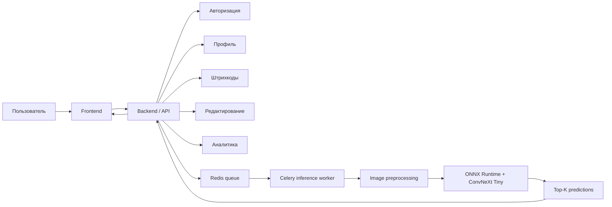

# Vredanol

## Краткое описание

Vredanol - это продуктовый сервис для работы с товарами, продуктами и пользовательскими данными. Он объединяет распознавание изображений, распознавание штрихкодов, профиль пользователя, авторизацию, редактирование данных и аналитику.

Предполагается, что фронтенд уже работает: пользователь авторизуется, загружает или делает фото товара, сканирует штрихкод, редактирует найденную информацию и видит аналитику по своим действиям или продуктам. ML-инференс выступает одним из backend-модулей: он принимает изображение, запускает ONNX-модель и возвращает наиболее вероятные категории с вероятностями.

В текущей конфигурации inference-модуля подключена food-модель: сервис распознает категории вроде `banana`, `bread`, `cheese`, `chicken`, `milk`, `tomato`, `yogurt` и другие.

## Продуктовая Идея

Сервис помогает пользователю быстрее работать с товарами и продуктами: не вводить все вручную, а получать подсказки по фотографии или штрихкоду. После распознавания пользователь может подтвердить результат, отредактировать данные и сохранить их в своем профиле.

Для бизнеса Vredanol может быть основой для каталога товаров, food-tech приложения, системы учета продуктов, внутреннего инструмента модерации или аналитической панели по пользовательским действиям.

## Как Работает Сервис

1. Пользователь авторизуется и работает в своем профиле.
2. Пользователь загружает фото товара или сканирует штрихкод.
3. Frontend отправляет данные в backend.
4. Backend выбирает сценарий: поиск по штрихкоду, ML-распознавание изображения или редактирование карточки.
5. Для изображений backend ставит задачу в очередь inference-worker.
6. Celery worker получает задачу `inference.classify`.
7. Сервис декодирует изображение из base64.
8. Изображение приводится к формату модели: RGB, resize, center crop, normalization.
9. ONNX Runtime запускает модель классификации.
10. Сервис возвращает `top_k` предсказаний.
11. Пользователь подтверждает или редактирует результат.
12. Данные сохраняются в профиле и попадают в аналитику.

## Основной Функционал

- Авторизация и персональная работа пользователя в сервисе.
- Профиль пользователя с сохранением истории и персональных данных.
- Классификация изображений еды и товаров.
- Распознавание штрихкодов для быстрого поиска товара.
- Редактирование найденной или распознанной информации.
- Аналитика по распознаваниям, действиям пользователя и товарам.
- Возврат нескольких наиболее вероятных классов, а не только одного ответа.
- Настраиваемый параметр `top_k`.
- Поддержка base64-изображений, включая data URL из браузера.
- Подключение разных наборов моделей: `food`, `grocery`, `general`.
- Работа через асинхронную очередь задач, чтобы не блокировать пользовательский интерфейс.
- Загрузка названий классов из отдельного файла.
- Конфигурация через `.env` без изменения кода.

## Пользовательские Сценарии

### Авторизация

Пользователь входит в сервис, получает доступ к личному кабинету и может безопасно сохранять результаты распознавания, историю действий и персональные настройки.

### Профиль

В профиле пользователь видит сохраненные продукты, историю распознаваний, отредактированные карточки и персональные данные. Это превращает сервис из одноразового распознавания в полноценный пользовательский продукт.

### Распознавание По Фото

Пользователь загружает изображение товара или еды. ML-модуль возвращает несколько вероятных вариантов, а интерфейс предлагает выбрать подходящий результат.

### Распознавание Штрихкодов

Пользователь сканирует штрихкод, после чего сервис может найти товар в базе, подтянуть информацию автоматически и сократить ручной ввод.

### Редактирование Данных

Если распознавание ошиблось или данных недостаточно, пользователь может вручную исправить название, категорию, описание или другие поля карточки.

### Аналитика

Сервис может показывать аналитику по распознаваниям, популярным категориям, частоте действий, качеству распознавания и активности пользователя.

## Технические Характеристики

| Параметр | Значение |
|---|---|
| Язык | Python 3.12 |
| ML runtime | ONNX Runtime |
| Модель | ConvNeXt Tiny в формате ONNX |
| Очередь задач | Celery |
| Broker / result backend | Redis |
| Обработка изображений | Pillow |
| Численные вычисления | NumPy |
| Конфигурация | Pydantic Settings + `.env` |
| Логирование | structlog |
| Доставка | Docker, Docker Compose |
| Текущая модель | `food` |
| Размер входа модели | 224x224 |
| Resize перед crop | 256 по короткой стороне |
| Execution provider | CPUExecutionProvider |

## Стек Проекта

- `Python 3.12` - основной runtime сервиса.
- `Celery` - выполнение тяжелых inference-задач в фоне.
- `Redis` - очередь и хранилище результата задач.
- `ONNX Runtime` - быстрый запуск модели без зависимости от обучающего фреймворка.
- `Pillow` - чтение и подготовка пользовательских изображений.
- `NumPy` - преобразование изображения в tensor-like массив.
- `Pydantic` - валидация входных данных и настроек.
- `Docker` - воспроизводимый запуск worker-сервиса.
- `uv` - быстрая установка зависимостей внутри Docker build.

Дополнительно на уровне полного продукта предполагаются:

- frontend для авторизации, профиля, редактирования и аналитики;
- backend API для пользовательских сценариев;
- база данных для пользователей, карточек, истории и аналитических событий;
- модуль штрихкодов для поиска товара по коду;
- inference-worker для ML-распознавания изображений.

## Архитектура



## Формат Входа И Выхода

Входная задача:

```json
{
  "image": "<base64-image>",
  "top_k": 20
}
```

Ответ:

```json
[
  {
    "label": "banana",
    "prob": 0.91
  },
  {
    "label": "bread",
    "prob": 0.04
  }
]
```

## Интересные Реализации В Коде

### 1. Отдельный inference-worker

ML-инференс вынесен в отдельный Celery worker. Это хороший продуктовый и технический паттерн: фронтенд и основной backend не зависают во время обработки изображения, а тяжелая задача выполняется отдельно.

### 2. Ленивый старт модели

В задаче `classify_task` модель загружается при первом обращении, если сервис еще не готов. Это позволяет worker стартовать гибко и не выполнять лишнюю работу до первого реального запроса.

### 3. Универсальная конфигурация модели

Пути к модели и файлу классов задаются через `.env`:

```env
MODEL_PATH=./models/convnext_tiny_food.data
MODEL_CLASSES_PATH=./models/food_classes.txt
```

За счет этого можно заменить food-модель на grocery или general без переписывания бизнес-логики.

### 4. Корректная подготовка изображения

Перед запуском модели изображение проходит полный preprocessing pipeline:

- декодирование base64;
- перевод в RGB;
- resize по короткой стороне;
- center crop до 224x224;
- перевод в `float32`;
- нормализация через mean/std;
- преобразование в формат `NCHW`.

Это делает входные данные стабильными и ожидаемыми для модели.

### 5. Top-K вместо одного результата

Сервис возвращает несколько вариантов с вероятностями. Для продукта это полезнее, чем один жесткий ответ: интерфейс может показать пользователю альтернативы и дать выбрать правильный товар.

### 6. Изолированный Docker runtime

Dockerfile использует multi-stage build, устанавливает зависимости отдельно и запускает сервис от non-root пользователя. Это хорошая база для production-деплоя.

### 7. Разделение Продуктовой Логики И ML

Распознавание изображения не смешивается с пользовательским профилем, авторизацией, аналитикой и редактированием. Это делает архитектуру гибкой: можно развивать продуктовые функции отдельно, а ML-модель обновлять независимо.

### 8. Человеческое Подтверждение Результата

Сервис не обязан слепо доверять модели. Он может показать пользователю несколько вариантов, дать отредактировать карточку и сохранить подтвержденный результат. Это важный продуктовый механизм: данные становятся точнее за счет пользовательской обратной связи.

## Функциональные Возможности Для Продукта

- Автоматическое распознавание еды по фото.
- Распознавание товара по штрихкоду.
- Быстрое добавление товара в корзину или дневник питания.
- Личный профиль пользователя.
- История действий и распознаваний.
- Редактирование карточек товаров.
- Авторизация и персонализация.
- Аналитика по товарам, категориям и активности.
- Подсказки пользователю, если модель не уверена.
- Автоматическое тегирование изображений в каталоге.
- Ускорение заполнения карточек товаров.
- Проверка соответствия изображения выбранной категории.
- Расширение на grocery/general модели без смены архитектуры.

## Пользовательская Ценность

Для пользователя сервис снижает ручной ввод: вместо поиска товара по названию можно загрузить фото или отсканировать штрихкод. Профиль сохраняет историю, а редактирование позволяет быстро исправить результат, если автоматическое распознавание не идеально.

Для бизнеса ценность в автоматизации: меньше ручной модерации, быстрее создание товарных карточек, удобнее поиск, выше конверсия в интерфейсе и больше данных о поведении пользователей. Аналитика показывает, какие категории чаще распознаются, где модель ошибается и какие сценарии наиболее востребованы.

## Возможный Продуктовый Кейс

Представим мобильное приложение для учета продуктов дома. Пользователь авторизуется, сканирует штрихкод молока или фотографирует продукт. Если штрихкод найден в базе, сервис сразу подставляет карточку товара. Если штрихкод не найден, включается ML-распознавание изображения: сервис возвращает вероятные категории, например `milk`, `cheese`, `yogurt`.

Пользователь выбирает правильный вариант, при необходимости редактирует карточку и сохраняет ее в профиль. Дальше эта информация может использоваться в аналитике: какие продукты пользователь добавляет чаще, какие категории популярны, где распознавание требует ручной правки.

Такой подход превращает ML-модель не просто в техническую функцию, а в пользовательский сценарий: авторизация, личный профиль, быстрое распознавание, меньше ручного ввода, понятный интерфейс с вариантами выбора и накопление полезных данных.

## Почему Архитектура Подходит Для Развития

- Можно масштабировать количество worker-процессов отдельно от frontend/backend.
- Можно подключать новые модели через `.env`.
- Можно заменить CPU provider на другой execution provider при необходимости.
- Можно добавить новые очереди для разных типов моделей.
- Можно сохранять результаты классификации и использовать их для аналитики.
- Можно встроить сервис в уже существующий frontend без изменения пользовательского сценария.
- Можно развивать профиль, авторизацию, аналитику и редактирование независимо от ML-модуля.
- Можно использовать штрихкоды как быстрый сценарий, а ML - как fallback, когда товара нет в базе.

## Итог Для Презентации

Vredanol - это не только ML-распознавание изображений, а более широкий продуктовый сервис для работы с товарами и пользовательскими данными. Он объединяет авторизацию, профиль, аналитику, распознавание штрихкодов, редактирование карточек и inference-модуль на ONNX Runtime.

Главная ценность сервиса - уменьшить ручной ввод и ускорить работу пользователя с товарами. Пользователь получает быстрые подсказки по фото или штрихкоду, может исправить результат и сохранить данные в профиле, а продукт получает аналитику и основу для дальнейшего улучшения качества распознавания.
