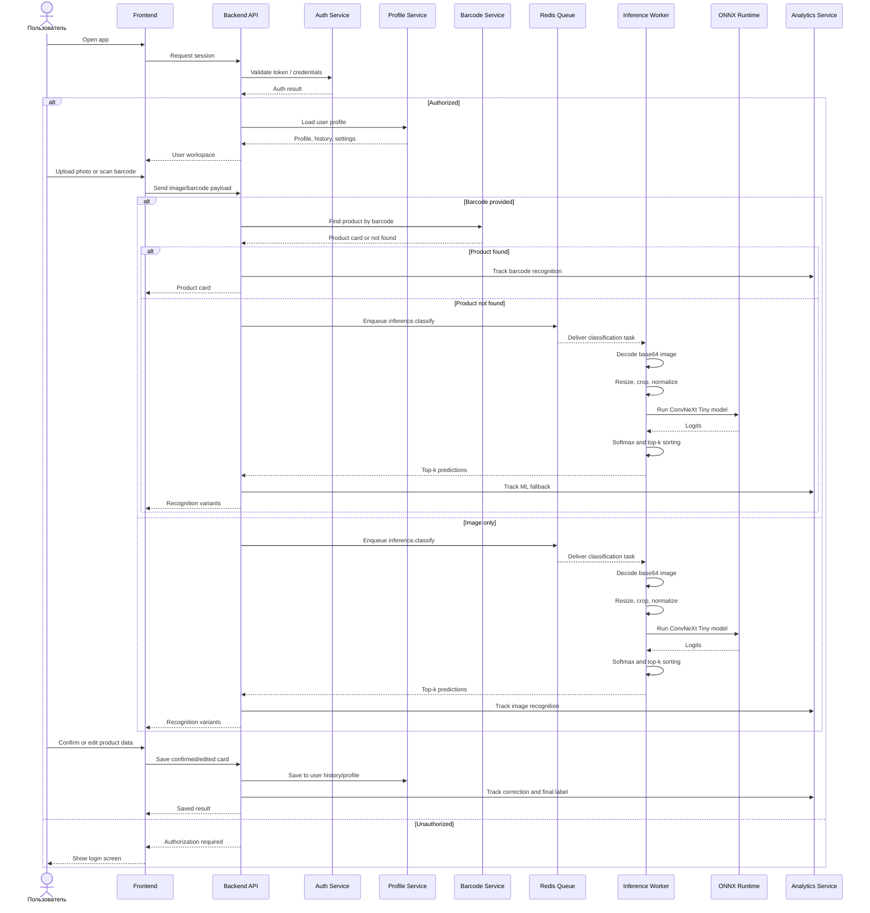

# UML: Service Flow

This diagram describes the main Vredanol service flow with the frontend already available. It shows authorization, profile usage, barcode recognition, ML image inference, result editing, and analytics.

## Key Service Responsibilities

- `Frontend` handles user interaction: login, upload, barcode scan, confirmation, and editing.
- `Backend API` coordinates product scenarios and chooses barcode or ML recognition flow.
- `Auth Service` protects personal profile and history.
- `Profile Service` stores user-specific data, recognition history, and edited cards.
- `Barcode Service` resolves known products by barcode.
- `Inference Worker` runs image classification in the background through Celery.
- `ONNX Runtime` executes the ConvNeXt Tiny model.
- `Analytics Service` collects recognition events, corrections, activity, and quality signals.
